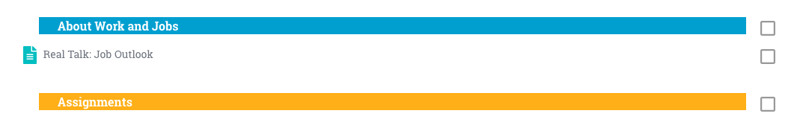
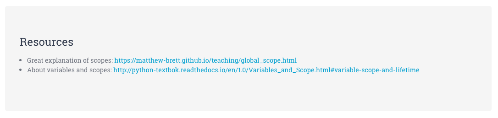
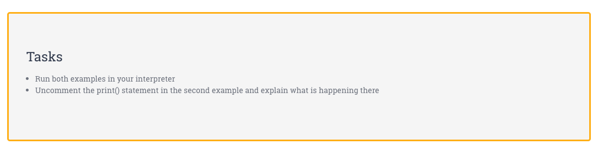
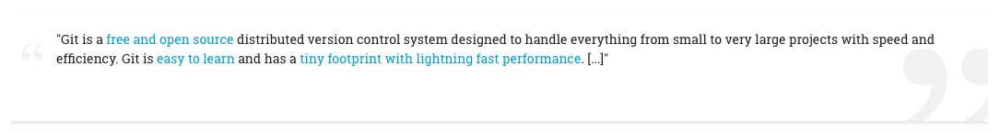

# Reusable Layout Components for CN Platform

- Objective
- Where?
- Components
    * Tags (Dividers)
        - Section Dividers
        - Assignment Dividers
    * Headings
    * Resources
    * Tasks
    * Quotes
    * Code Blocks
- Formatting
    * Code Blocks
    * Code font size
    * Documentation font size


## Objective

Lay the groundwork for **unified and adaptable styling** across all courses on the whole site.

- **simple**: simple elements favored over complex ones (easier to set up and maintain)
- **reusable components**: HTML elements with CSS classes
- **centralized**: Styling only through SCSS in Maker Theme
- **maintainable**: Edit centrally, avoid unnecessary effort and potential misalignment

## Where?

`Site administration / Appearance / Maker / Advanced Settings / Raw SCSS`

**Design changes** for these components can be made centrally in the [**Maker** Theme settings](https://platform.codingnomads.co/learn/admin/settings.php?section=themesettingmaker). Click into the "Advanced Settings" tab and add/change CSS inside the second SCSS box.

---

## Components

Components to use when creating and editing courses. Add new components in this section.

### Tags (Dividers)

#### Section Dividers

```html
<h5 class="section-divider">Section Mini-Heading</h5>
```

#### Assignment Dividers

```html
<h5 class="section-assignment">Assignments</h5>
```



### Headings

**Use Editor-provided headings**:

- "Heading (large)" option creates `<h3>` element
- "Heading (medium)" option creates `<h4>` element
- "Heading (small)" option creates `<h5>` element

**Don't apply editor styles to headings** - we can increase heading size, font-weight,
etc. centrally through SCSS.

### Resources

```html
<div class="jumbotron resources">
<h1>Resources</h1>
</div>
```

Paste HTML into HTML editor of Page Activity.
Switch to Editor view and copy-paste your Resource links into the body of the jumbotron, and style as bullet point list.



### Tasks

```html
<div class="jumbotron tasks">
<h1>Tasks</h1>
</div>
```

Same as for Resources.



### Quotes

Minimal example:

```html
<p class="quote-card">Quote goes here<p>
```



Check out the [Maker Theme SCSS](https://platform.codingnomads.co/learn/admin/settings.php?section=themesettingmaker) for more options.


### Code Blocks

Wrap code snippets into triple-backticks:

    ```
    print("your code here")
    ```

Note: Syntax highlighting is sometimes broken.


---

## Formatting

Collection of style changes and justification for those changes.

### Code font size

Slightly increased code font-size: `code {font-size: 1.1em;}`. It was hard to read the code before.


### Documentation font size

General font-size is currently also relatively small, could be increased.
